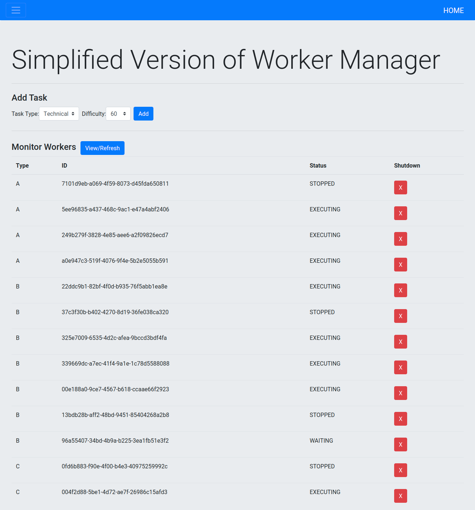

# INTRODUCTION
A simplified version of worker manager

<div align="center">
  
</div>

# DETAILS
 - There are two types of task: Business and Technical
 - There are 3 types of worker: Type A (speed = 1.5), Type B (speed = 1.2), Type C (speed = 1)
 - Business Tasks can be excuted by worker type A and B
 - Technical Tasks can be excuted by worker type A and C

# FEATURES
 - Add tasks to message queue
 - View worker's status
 - Grateful shutdown a worker

# REQUIREMENTS
Python >= 3.7
 - [Flask](https://pypi.org/project/Flask/)

# USAGE
```
python main.py
```
The website will be shown at **localhost:8000**